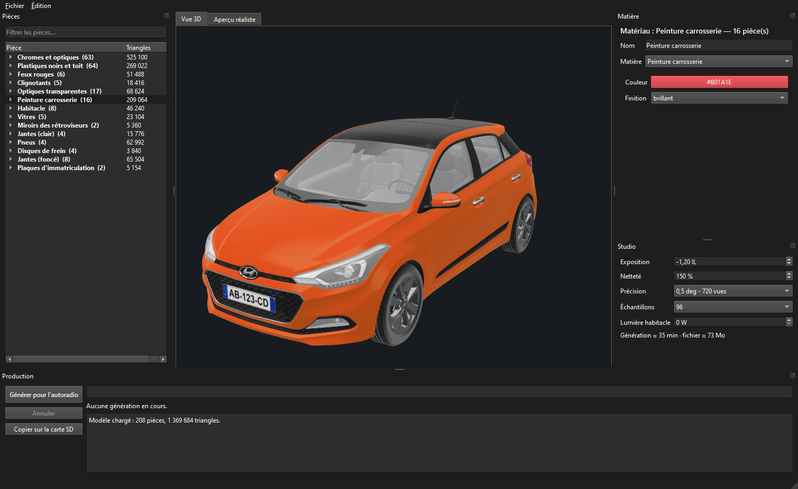
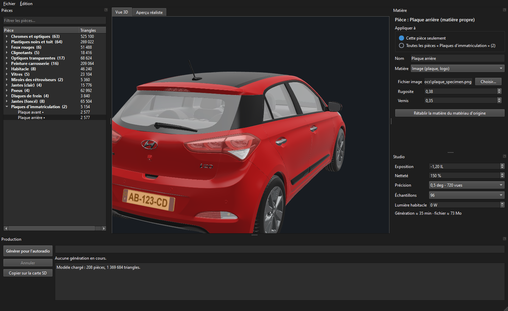
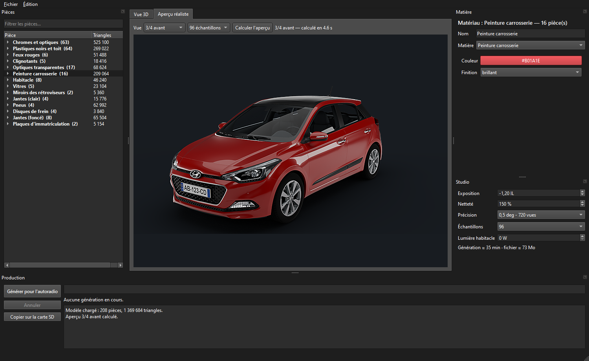
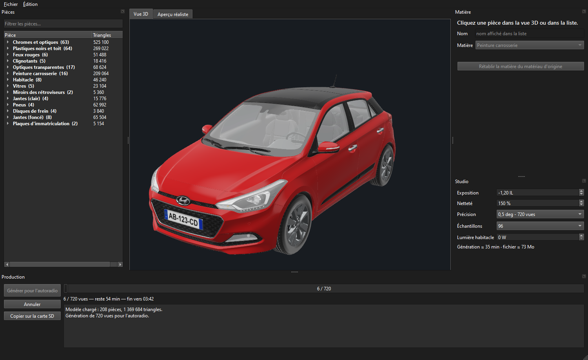
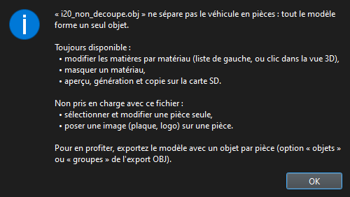

  

  <strong>Customize a 3D car model and produce its 360° rotation for the head unit.</strong>

  

  
  
  
  
  

  <a href="#features">Features</a> ·
  <a href="#installation">Installation</a> ·
  <a href="#getting-started">Getting started</a> ·
  <a href="#guide">Guide</a> ·
  <a href="#compatibility">Compatibility</a> ·
  <a href="#faq">FAQ</a>

---

HyStudio is a desktop application that turns a 3D car model into a smooth
animation, displayed by the `i20view` viewer on the Hyundai i20 head unit.
Materials, logos, photorealistic preview, generation and installation on the SD
card: everything happens in a single window, with no command line.

Screenshots show the French interface; HyStudio follows your Windows language.

## Features

| | |
|---|---|
| **Car library** | Pick a car from a gallery of covers and start a project in one double-click. |
| **Visual editing** | Pick parts with the mouse and apply realistic materials: gloss, satin or matte paint, chrome, metal, plastic, rubber, glass. |
| **Logos and plates** | Stickers laid over the bodywork without distortion; images mapped onto flat parts such as licence plates. |
| **Textured models** | glTF import with textures (dashboard, gauges, interior); OBJ import with optional use of the `.mtl` file. |
| **Faithful preview** | Blender Cycles render of a single view in seconds, identical to what the head unit will display. |
| **Complete production** | Rotation of 180 to 720 views, compressed to the viewer's format, with an estimated finish time. |
| **Safe installation** | SD card detection, volume integrity check, MD5-verified copy, automatic eject. |
| **Always up to date** | Checks for new versions at startup and updates in one click, keeping your projects and models. |
| **Comfort** | Unlimited undo (`Ctrl+Z` / `Ctrl+Y`), interface in 9 languages, automatic detection of model units. |

## Installation

### Installer

1. [Download the latest release](https://github.com/Game-K-Hack/hystudio/releases/latest)
   (`HyStudio-<version>-Setup.exe`) and run it. No administrator rights are
   needed; HyStudio is added to the Start menu and to Windows' installed apps.
2. Install [Blender 4.2](https://www.blender.org/download/lts/4-2/), or drop its
   portable version into a `blender…` folder in `Documents\HyStudio`.
3. Launch **HyStudio**.

HyStudio finds Blender automatically.

| Data | Location |
|---|---|
| Application | `%LOCALAPPDATA%\Programs\HyStudio` |
| Projects | `Documents\HyStudio\projets` |
| Cache (recomputable) | `%LOCALAPPDATA%\HyStudio` |

### Updates

At startup, HyStudio checks GitHub for a newer release, silently when offline.
When one is available, it shows the release notes and offers to **Update**,
postpone, or skip that version; **? › Check for updates** runs the check at any
time. The update is downloaded and verified, then installed: only the
application is replaced, your projects, models and cache are never touched, and
HyStudio restarts on its own.

### From source

Requirements: Python 3.14 with PySide6, PyOpenGL, numpy and Pillow, plus
Blender 4.2. Double-click **`HyStudio.pyw`** to start.

To build the installer, run `build_exe.py` (requires PyInstaller and
[Inno Setup 6](https://jrsoftware.org/isinfo.php)): it produces the application
folder `dist\HyStudio` and the installer `dist\HyStudio-<version>-Setup.exe`
to attach to the GitHub release.

### System requirements

- Windows 10 or 11, graphics card supporting OpenGL 3.3
- Blender 4.2 LTS; an NVIDIA RTX card greatly speeds up rendering

## Getting started

1. **Open a model**: pick a car in **File › Car library** (`Ctrl+B`), or use
   **File › New project from a 3D model** and choose a `.gltf`, `.glb` or `.obj`
   file. You can also drop a model onto the window.
2. **Customize**: click a part in the 3D view and change its material in the
   **Material** panel.
3. **Check**: the **Realistic preview** tab shows the final result from the
   chosen angle.
4. **Generate**: **Generate for the head unit** renders and compresses every view.
5. **Install**: insert the head unit's SD card, then click **Copy to SD card**.

## Guide

### Car library

**File › Car library** (`Ctrl+B`) shows every car of the library as a cover,
with a search field. Double-click a car, or select it and click **Create
project**, to start a project with its model.

The library is a folder with one sub-folder per car: the folder name is the car
name, and it contains the model (`.glb`, `.gltf` or `.obj`) and a `cover.jpg`
preview. **Open the library folder** opens it directly:

| Edition | Library folder |
|---|---|
| Installed | `Documents\HyStudio\models` |
| From source | `models` next to `hystudio.py` |

When no project is available at startup, HyStudio opens the library on its own.

### Opening projects

Projects are saved as `.hysp` files. Besides **File › Open project**, you can:

- double-click a `.hysp` file, once the installer option **Open .hysp project
  files with HyStudio** is ticked (it is by default);
- drop a `.hysp` file onto `HyStudio.exe` or its shortcut;
- drop a `.hysp` file onto the HyStudio window, or a 3D model to start a new
  project.

### Materials

Clicking in the 3D view or in the list selects a part; clicking a group selects
every part sharing the same material. The **Material** panel then offers two
scopes:

- **This part only**: the part gets its own material, marked with • in the list;
- **All parts with this material**: the change applies to the whole group.

The **Name** field renames a part to keep the list readable.

### Logos and plates

| Need | Tool | How it works |
|---|---|---|
| Logo on a door, stripe on the bonnet | **Sticker** | Image laid over the material, visible only on faces turned towards the chosen view. Adjustable size, position and rotation. |
| Licence plate, flat part | **Image material** | Image stretched over the whole part, fitted to its edges. |

To place a sticker, turn the 3D view to face the spot, then choose
**Sticker › Place an image**. Applied to a group such as "Body paint", a single
sticker spans the whole group. A PNG with a transparent background gives a
clean outline.

Screenshots use a fictitious licence plate.

### Preview and studio settings

The 3D view is for identifying parts; the **Realistic preview** tab renders a
photorealistic view in seconds, at the head unit's exact format (800 × 424).

The **Studio** panel controls:

| Setting | Effect |
|---|---|
| Exposure | Overall brightness of the render |
| Sharpness | Detail enhancement after downscaling |
| Precision | 180, 360 or 720 views per turn (2°, 1° or 0.5° per view) |
| Samples | Lighting quality, at the cost of render time |
| Cabin light | Interior lighting, visible through the windows |

Duration and file size are estimated in real time.

### Generation and installation

**Generate for the head unit** renders the full rotation and compresses each view
as it goes, with a progress bar and the expected finish time. The render can be
cancelled; the file is written only once complete.

**Copy to SD card** recognizes the head unit's card, refuses to write to a
damaged volume, copies the rotation and the viewer, verifies the copy, then
ejects the card.

### Language

The interface follows the Windows language: English, French, Spanish, German,
Italian, Russian, Chinese, Japanese or Korean, with English for any other
language. The **Language** menu switches at any time without closing the open
project.

## Compatibility

### Model formats

| Format | Geometry | Textures | Materials | Note |
|---|:---:|:---:|:---:|---|
| glTF 2.0 (`.gltf`, `.glb`) | ✓ | ✓ | ✓ | Recommended |
| OBJ (`.obj` + `.mtl`) | ✓ | — | `.mtl` colours, on request | Y axis up |

- **glTF**: textured materials keep the **Original material** type and render
  exactly as the file describes them; the others become editable HyStudio
  materials.
- **OBJ**: if the `.mtl` file contains real values, HyStudio offers to use them.
  **File › Import materials from an MTL file** applies them later to an existing
  project.
- **Units**: metres, decimetres, centimetres, millimetres or tenths of a
  millimetre, detected from the vehicle's length.
- **Parts**: selecting a single part and placing images require a model split
  into objects. Otherwise HyStudio says so and keeps per-material editing,
  preview and generation.

### Projects

Projects are saved as `.hysp`. The older `.hyproj` and `.carproj` formats still
open.

### Version

The current version appears in the window title and in **? › About HyStudio**.
Changes between versions are listed in the [changelog](CHANGELOG.md).

## FAQ

<strong>How long does a generation take?</strong>

Each view is a real lighting computation: allow about 35 minutes for 720 views on
an RTX 3080. Fewer samples speed things up; check the grain in the preview before
starting the generation.

<strong>How much space does the rotation take on the head unit?</strong>

About 100 KB per view, i.e. 73 MB for 720 views. HyStudio warns when the file
approaches the memory available on the head unit.

<strong>The model appears lying on its side.</strong>

The OBJ file was exported with the Z axis up. Export it again with the Y axis up,
Blender's default setting, or use its glTF version.

<strong>The dashboard colours don't show.</strong>

They come from textures, which the OBJ format usually does not keep. Open the
glTF version of the model when available.

<strong>The interior stays dark despite the cabin light.</strong>

A nearly black interior reflects little light. Lighten the interior material
rather than increasing the power.

<strong>How do I undo a change?</strong>

`Ctrl+Z` undoes and `Ctrl+Y` redoes, also from the **Edit** menu. Materials,
names and studio settings are covered; several small successive adjustments of
the same setting are undone in one step.

